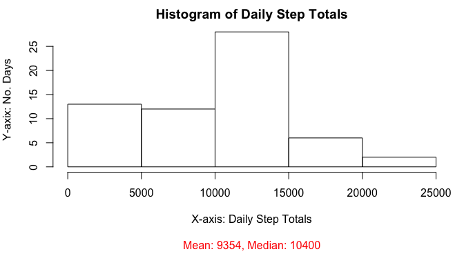
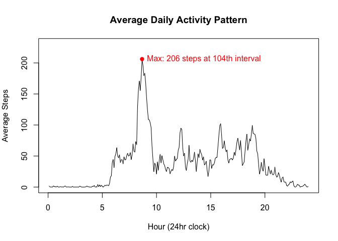
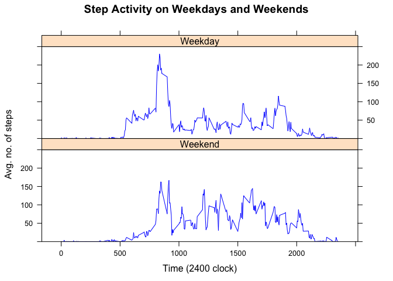

# Report: Using Step Data To Assess Behavior

This paper analyzes an anonymized individual's personal activity in order to draw inferences about lifestyle choices and patterns of behavior.  For the purposes of this analysis, personal activity is indicated by a monitoring device that collects step data at 5-minute intervals throughout the day. This paper is based on an assignment from the Johns Hopkins University's ["Reproducible Research"](https://www.coursera.org/course/repdata) offered through Coursera.

## Loading and preprocessing the data

We begin by loading the data. The dataset is a zipped CSV file with 17,568 observations across three variables:  

+ "steps" records the number of steps taken during the interval.  
+ "date" is the date of the measurement.  
+ "interval" identifies the 5-min interval when the measurement was taken.  


```r
getData <- function(file, url) {
    # Gets file from web and unzips it into working directory
    found <- F
    if (file %in% dir()) {
        found <- T
    }
    if (!found) {
        download.file(url, "tmp.zip", method = "curl")
        unzip("tmp.zip", unzip = "internal")
        unlink("tmp.zip")
    }
}

getData("activity.csv","https://d396qusza40orc.cloudfront.net/repdata%2Fdata%2Factivity.zip")
dateDownloaded <- date() #Date of data download
```

The data can now be read into R as a data frame for further analysis.


```r
stepData <- read.table("./activity.csv",
                           sep=",",
                           header=TRUE, 
                           na.strings = "NA", 
                           stringsAsFactors = TRUE)
```

## What is mean total number of steps taken per day?

The mean of daily step totals helps us undertand the individual's average level of activity during the time period (October through November 2012).  


```r
stepTotals <- with(stepData,by(steps,date,sum,na.rm=TRUE))
stepTotalMean <- summary(stepTotals)[[4]] #mean
stepTotalMedian <- summary(stepTotals)[[3]] #median
```

* The individual averaged 9354 total steps per day.
* The median was 1.04\times 10^{4} (scientific notation).
* These meausres (mean and median) also reported in the histogram below.

A histogram plot lets us see how frequently (i.e., how many days) the individual met or exceeded his/her average step activity.


```r
par(mar=c(7,4,2,1)) #Create extra space in margin for additional text
    hist(stepTotals, #Plot histogram of total daily steps taken
         xlab="X-axis: Daily Step Totals", 
         ylab="Y-axix: No. Days", 
         main="Histogram of Daily Step Totals")
    mtext(text=sprintf("Mean: %d, Median: %d",stepTotalMean,stepTotalMedian),
          side=1,
          line=5, 
          col="red")
```

 

## What is the average daily activity pattern?

So far, we have a picture of the individual's activity on a daily basis, but we have little insight into how that activity is distributed throughout the day.  In order to answer questions like, "what time of day is the individual most active?," we average step activity across each 5-min interval for all days.


```r
# Reshape data so each row is a 5-min interval and each colum a different day
compareDailyData <- matrix(stepData$steps,nrow=288, ncol=61)
# calculate average number of steps taken for each interval across all days
intervalMeans <- rowMeans(compareDailyData,na.rm=TRUE)
# interval with highest average steps
maxValue <- max(intervalMeans,na.rm=TRUE)
maxPosition <- match(maxValue,intervalMeans)
```

* The 104th 5-min interval has the highest average step total (206.1698113 steps), which corresponds to 8:40 AM.

To see this, we plot the average total steps for each interval.


```r
par(mar=c(5,4,4,2))
plot(1:288*5/60,intervalMeans,type="l",
     ylab="Average Steps",
     ylim=c(0,230),
     xlab="Hour (24hr clock)",
     main="Average Daily Activity Pattern")
points(x=maxPosition*5/60,y=maxValue,pch=19,col="red")
text(x=maxPosition*5/60,y=maxValue, 
     col="red",pos=4,
     labels=sprintf("Max: %.0f steps at %dth interval",maxValue,maxPosition))
text(x=20,y=170,labels=sprintf("Date of data download: "),cex=.8,col="blue")
text(x=20,y=150,labels=sprintf("%s",dateDownloaded),cex=.8,col="blue")
```

 

## Imputing missing values

The step data from the personal activity monitor contains a number of days/intervals where there are missing values (coded as NA). The presence of missing days may introduce bias into some calculations or summaries of the data.


```r
numMissing <- sum(is.na(stepData$steps))
percentMissing <- sum(is.na(stepData$steps))/dim(stepData)[[1]] *100
```

* There are 2304 intervals where no step data was recorded.  
* This means 13.1147541 percent of the data is missing.

We impute missing values by locating NAs and replacing them with the mean for that interval averaged across all days.


```r
m <- dim(compareDailyData)[[1]] # number of rows
n <- dim(compareDailyData)[[2]] # number of columns
    
imputedDailyData <- compareDailyData # make a copy
intervalMeans <- rowMeans(compareDailyData,na.rm=TRUE) # calculate interval means
    
for (i in 1:m){
    for (j in 1:n){
        if (is.na(compareDailyData[i,j])){
            imputedDailyData[i,j]<-intervalMeans[[i]] #mean value for that interval
        }
    }
}
    
imputedStepData <- data.frame(
    steps=matrix(imputedDailyData,nrow=m*n,ncol=1),
    date=as.POSIXct(stepData$date),
    interval=as.integer(stepData$interval)
    )
```

We assess the effect imputation has on our data by comparing histograms of daily step totals before and after imputation.

* Imputing missing values in this way appears to over-represent the number of days at the original mean.


```r
par(mfrow=c(1,2),oma=c(2,0,2,0))
# Before imputation (with NAs)
stepTotals <- with(stepData,by(steps,date,sum,na.rm=FALSE))
stepTotalMean <- summary(stepTotals)[[4]] #mean
stepTotalMedian <- summary(stepTotals)[[3]] #median

# After imputation (without NAs)
stepTotalsImputed <- with(imputedStepData,by(steps,date,sum,na.rm=FALSE))
stepTotalMeanImputed <- summary(stepTotalsImputed)[[4]] #mean
stepTotalMedianImputed <- summary(stepTotalsImputed)[[3]] #median

hist(stepTotals, 
     main="Before Imputation (With NAs)", 
     ylab="No. Days",
     xlab=sprintf("Mean: %d, Median: %d",stepTotalMean,stepTotalMedian), 
     ylim=c(0,40), 
     cex.main=.8)

hist(stepTotalsImputed,
     main="After Imputation (W/o NAs)",
     ylab="No. Days",
     xlab=sprintf("Mean: %d, Median: %d",stepTotalMeanImputed,stepTotalMedianImputed),
     ylim=c(0,40),
     cex.main=.8)
mtext("Daily Step Totals",side=1, outer=TRUE)
mtext("Histogram Comparison",side=3,outer=TRUE)
```

 


## Are there differences in activity patterns between weekdays and weekends?

We compare activity during the week with activity on the weekends.    

- The individual appears to get up earlier during the week, possibly indicating the start of the work- or school-day.  
- The individual appears to have more periods of inactivity during the weekday, possibly indicating times seated for a meeting or working at a desk.


```r
library(lattice)

daysOfWeek <- c("Monday","Tuesday","Wednesday","Thursday","Friday")
    
imputedStepData$is.weekday <- as.factor(weekdays(imputedStepData$date) %in% daysOfWeek) #FALSE is default first level

levels(imputedStepData$is.weekday)<-c("Weekend","Weekday") #give more descriptive level names

p <- xyplot(steps~interval|is.weekday,
            data=imputedStepData,
            layout=c(1,2),
            ylim=c(0,250),
            xlab="Time (2400 clock)",
            ylab="Avg. no. of steps",
            main="Step Activity on Weekdays and Weekends",
            panel=function(x,y,...){
                panel.average(x,y,
                              fun=mean,
                              horizontal=FALSE,
                              type="l",
                              col.line="blue")
                }
            )
print(p)
```

 
